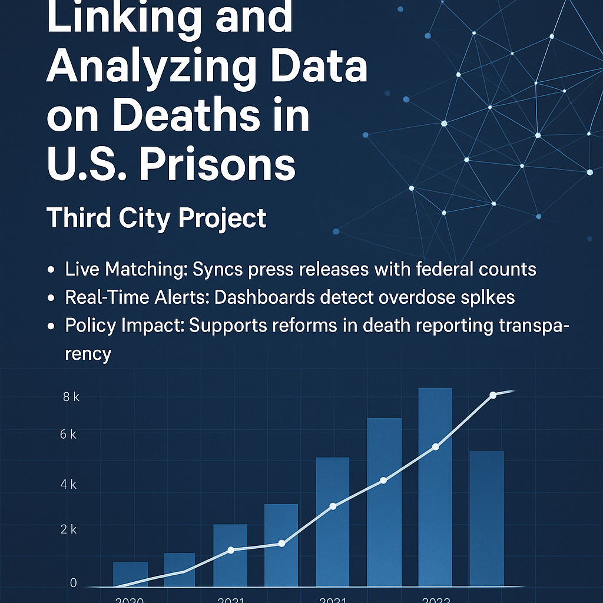

# Linking and Analyzing Data on Deaths in U.S. Prisons

## Overview

This project links and analyzes fragmented data sources to build a transparent, data-driven view of prison mortality in the United States. It is part of the Third City Project, an initiative under the Bellwether Collective for Health Justice that promotes data transparency and health equity for individuals impacted by the criminal legal system.

## Team

- **Team Members**: Ramil Mammadov, Johnathan Ross, Sam Grossman  
- **Project Leads**: Dr. Lauren Brinkley-Rubinstein, David Cloud  

## Background

- The Death in Custody Reporting Act (2013) requires all U.S. prison systems to report in-custody deaths to the Department of Justice (DOJ).
- The DOJ stopped publishing this data after 2019 due to enforcement failures.
- To fill the gap, the Third City Project created a comprehensive dataset by merging federal records with state press releases.

## Objectives

Some of the key research questions driving this project include:

1. Expand the Third City Project’s dataset using press releases from state Departments of Corrections.
2. Analyze mortality trends using exploratory data analysis and machine learning methods.
3. Build an interactive map to visualize prison deaths and incarceration data across U.S. states.

## Data Sources

- **State DOC Press Releases**: Manually entered via Qualtrics (names, causes, dates).
- **Bureau of Justice Statistics (BJS)**: Death records from 2015–2019 with standardized demographics. 
- **Bureau of Justice Assistance (BJA)**: Ongoing records from the Deaths in Custody Reporting Program (DCRA).

## Methodology

- Linking federal records with state press releases
- Data cleaning, validation, and formatting
- Exploratory data analysis (EDA)
- Visual tools including an interactive map
- Statistical and ML modeling for deeper trend detection
- Documentation of oversight agencies and state reporting compliance

## Key Findings

- 18% increase in prison deaths from 2020 to 2023.
- Over 50% of deaths came from 10 states, led by Texas, California, and Florida.
- Race & Sex Disparities:
    - Deaths: White ≈ 14,000, Black ≈ 8,000.
    - 63% of female and 55% of male deaths were White.
    - Over 70% were non-Hispanic; ~20% had missing ethnicity data.
- Manner of Death: Mostly natural causes; also suicides and force-related deaths.
- Age Profile: Deaths peak between ages 50–70.
- Facility Type: Most deaths occurred in state prisons.

## Interactive Map

- Built using BJS data (2015–2019) for consistency and completeness.
- Allows filtering by year and state.
- Displays both demographic and prison-specific data.
- Aids in identifying disparities across geography, race, and policy.

## Limitations

- Incomplete or delayed reporting from some states
- Inconsistent terminology and formats
- Missing demographic and cause-of-death data
- Lack of updated federal data after 2019
- Limited local resources for reporting and validation

## Deliverables

* Linked and cleaned datasets.
* State-by-state analysis with interactive visualizations.
* Public-facing dashboard and map.
* Tables on reporting law compliance and oversight.
* Policy-relevant summaries and insights.

## Future Work

1. Link more federal and state records; update the Third City database via Qualtrics.
2. Finalize BJA data (2020–2024) for public integration.
3. Enhance the interactive map and publish for public use.
4. Apply statistical and ML models for trend discovery.
5. Collaborate with Third City to develop a policy brief for reform stakeholders.

